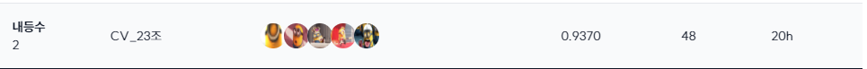

# 🏆 Sketch 이미지 분류를 위한 Image Classification

<br />

## ✏️ Introduction
Computer Vision에서는 다양한 형태의 이미지 데이터가 활용되고 있습니다. 그 중 스케치는 인간의 상상력과 개념 이해를 반영하는 추상적이고 단순화된 형태의 이미지입니다. 이러한 스케치 데이터는 색상이나 질감과 같은 세부적인 정보가 상대적으로 부족하지만, 객체의 기본적인 형태와 구조에 중점을 두고 표현되는 특징이 있습니다. 이번 프로젝트는 이러한 스케치 데이터의 특성을 분석하여 모델이 객체의 기본적인 형태와 구조를 학습 및 인식하도록 함으로써 일반적인 이미지 데이터와의 차이점을 이해하고 모델 개발 역량을 높이는데에 초점을 두었습니다.  
<br />

## 📅 Schedule
프로젝트 전체 일정

- 2024.09.10 ~ 2024.09.26

프로젝트 세부 일정

- 2024.09.10 ~ 2024.09.12 : 데이터셋 분석 및 EDA
- 2024.09.12 ~ 2024.09.15 : Augmentation 실험
- 2024.09.10 ~ 2024.09.26 : Model 실험
- 2024.09.13 ~ 2024.09.14 : 코드 모듈화
- 2024.09.24 ~ 2024.09.26 : 모델 앙상블 실험
- 2024.09.25 ~ 2024.09.26 : 모델 평가
- 2024.09.25 ~ 2024.09.26 : Wandb 연동

<br />

## 🥈 Result
- Private 리더보드에서 최종적으로 아래와 같은 결과를 얻었습니다.


<br />

## 🗃️ Dataset
```
data/
│
├── sample_submission.csv
├── test.csv
├── train.csv
│
├── test/
│   ├── 0.JPEG
│   ├── 1.JPEG
│   ├── 2.JPEG
│   ├── ...
│
	├── train/
│   ├── n01443537/
│   ├── n01484850/
│   ├── ... 
```
데이터셋은 검수 및 정제된 ImageNet Skech 데이터셋으로 이미지 수량이 많은 상위 500개의 객체로 이뤄져 있으며, 데이터는 다음과 같이 요약됩니다.
- 각 클래스에 따라 파충류, 개 등 유사한 클래스가 다수 포함되어 있습니다.

	|  |  |
	| :---: | :---: |
	| n01729322 (target 32) | n01735189 (target 33) |


- 각 클래스 당 29~31개의 이미지를 가지고 있습니다.

  

- 이미지의 크기는 다양하며, 밑의 그래프를 따릅니다.

  

- 학습데이터는 15,021개이며, 평가데이터는 10,014개입니다.
<br />

## ⚙️ Requirements

### env.
이 프로젝트는 Ubuntu 20.04.6 LTS, CUDA Version: 12.2, Tesla v100 32GB의 환경에서 훈련 및 테스트되었습니다.

### Installment
또한, 이 프로젝트에는 다앙한 라이브러리가 필요합니다. 다음 단계를 따라 필요한 모든 의존성을 설치할 수 있습니다.
``` bash
  git clone https://github.com/boostcampaitech7/level1-imageclassification-cv-23.git
  cd sketch-classification
  pip install -r requirements.txt
```

<br />

## 🎉 Project

### 1. Structure
  ```bas
  ├── data
  │   ├── augmentation.py
  │   ├── dataset.py
  │   ├── DDHS_muti.ipynb
  │   ├── __init__.py
  │   └── readme.md
  ├── ensemble_inference.py
  ├── ensemble.sh
  ├── evaluation.py
  ├── evaluation.sh
  ├── imgs
  │   └── result.png
  ├── inference.py
  ├── inference.sh
  ├── model
  │   ├── __init__.py
  │   ├── model.py
  │   └── readme.md
  ├── README.md
  ├── src
  │   ├── early_stopping.py
  │   ├── __init__.py
  │   ├── loss.py
  │   ├── loss_visualization.py
  │   └── readme.md
  ├── sweep_config.yaml
  ├── sweep_run.sh
  ├── train.py
  ├── train.sh
  ├── utils
  │   ├── ensemble_and_evaluation.py
  │   ├── __init__.py
  │   └── utils.py
  ├── wandb_ex.md
  └── wandb_train.py
  ```

### 2. train
- 모델 훈련을 위해 다음을 실행하세요
  ```bash
  bash train.sh
  ```
- 하이퍼파라미터 및 인자 설명

  - **lrs**: 모델 학습 시 가중치 업데이트의 크기를 결정합니다.

  - **batch_size**: 한 번에 처리할 데이터 샘플의 수을 결정합니다.

  - **epochs**: 전체 데이터셋을 몇 번 반복하여 학습할 것인지를 결정합니다.

  - **gamma**: 학습률 스케줄링에서 사용되는 감쇠 비율을 결정합니다.

  - **lr_decay**: 학습률 감소 주기를 결정합니다.

  - **L1 및 L2**: L1, L2 규제를 위한 하이퍼파라미터를 결정합니다.

  - **early_stopping_delta**: Early Stopping를 판단을 위한 허용 오차 결정합니다.

  - **early_stopping_patience**: 성능 향상이 없을 때 기다리는 에폭 수 결정합니다.

  - **cross_validation_expression**: cross_validationd을 위한 명시적 변수입니다. (Cross validation을 원치 않을 때는 flag를 지우면 됩니다.)

  - **AMP**: 학습 속도를 위한 자동 혼합 정밀도 (Automatic Mixed Precision)의 명시적 변수입니다. (FP16으로 설정되며, AMP을 원치 않을 때는 flag를 지우면 됩니다.)

  - **scheduler_type**: 사용하고자 하는 학습률 스케줄러의 종류를 cosine으로 결정합니다. (이 flag가 없으면 StepLR이 됩니다.)

  - **min_lr**: 

  - **epochs_per_restart**:

  - **models_and_img_sizes**: 사용할 모델과 입력 이미지의 크기를 지정합니다. (모델 이름과 이미지 크기는 띄어쓰기로 구분됩니다.)

  - **train_csv_file**: 학습에 사용할 데이터의 경로를 결정합니다.

  - **traindata_info_file**: 학습 데이터에 대한 추가 정보를 담고 있는 파일의 경로입니다.

  - **save_result_path**: 학습 결과 및 모델을 저장할 경로입니다.

### 3. Inference
- 모델 추론을 위해 다음을 실행하세요
  ```bash
  bash inference.sh
  ```
- 하이퍼파라미터 및 인자 설명
  - train.sh와 동일하지만, 모델과 이미지 크기를 나눠서 받습니다.
  - **model_name**: 추론에 사용할 모델의 이름입니다.

  - **img_size**: 입력 이미지의 크기를 정의합니다.

  - **testdata_dir**: 테스트에 사용할 데이터의 경로를 지정합니다.

  - **testdata_info_file**: 테스트 데이터에 대한 추가 정보를 담고 있는 파일의 경로를 지정합니다.

  - **save_result_path**: 추론 결과를 저장할 경로를 지정합니다.


### 4. ensemble
- 앙상블 학습을 위해 다음을 실행하세요
  ```bash
  bash ensemble.sh
  ```
- 하이퍼파라미터 및 인자 설명
  - **model_n_img_size**: 사용할 모델들과 이미지 크기를 정의합니다. 형식: `"모델이름,모델타입,이미지크기;..."`입니다.
  - 외에 train.sh 및 inference.sh와 동일합니다.

### 5. evaluation

<br />

## 🧑‍🤝‍🧑 Contributors
<div align="center">
<table>
  <tr>
    <td align="center"><a href="https://github.com/Yeon-ksy"><br /><sub><b>김세연</b></sub><br />
    </td>
        <td align="center"><a href="https://github.com/jihyun-0611"><br /><sub><b>안지현</b></sub><br />
    </td>
        <td align="center"><a href="https://github.com/dhfpswlqkd"><br /><sub><b>김상유</b></sub><br />
    </td>
        <td align="center"><a href="https://github.com/K-ple"><br /><sub><b>김태욱</b></sub><br />
    </td>
        <td align="center"><a href="https://github.com/myooooon"><br /><sub><b>김윤서</b></sub><br />
    </td>
  </tr>
</table>
</div>

## ⚡️ Detail   
- 프로젝트에 대한 자세한 내용은 [Wrap-Up Report](https://onedrive.live.com/edit?id=1D3C82CAEE19B27B!sbb0352dc60244cd4bd69c3597c7c9088&resid=1D3C82CAEE19B27B!sbb0352dc60244cd4bd69c3597c7c9088&cid=1d3c82caee19b27b&ithint=file%2Cdocx&redeem=aHR0cHM6Ly8xZHJ2Lm1zL3cvYy8xZDNjODJjYWVlMTliMjdiL0VkeFNBN3NrWU5STXZXbkRXWHg4a0lnQnFfbU1nbTNfUVlnUFhyQ193d0otQWc_ZT16ZDRlbWI&migratedtospo=true&wdo=2) 에서 확인할 수 있습니다.
